# onpkg ⚡ Online Package & Template Manager for Developers and AI Agents

<p align="center">
  
</p>

<p align="center">
  <b>onpkg</b> · universal online package & template manager
</p>

<p align="center">
  <a href="https://www.rust-lang.org/"></a>
  
  
</p>

<p align="center">
  ✨ <b>Vibe coded by Aswin</b> ✨
</p>

**onpkg** is a high-performance, online-first package and template manager engineered in Rust for developers and AI agents. It scaffolds full premium project architectures instantly, automatically installs dependencies online using the best runtime package manager (`bun`, `npm`, `pnpm`, `yarn`, `uv`, `pip`, `flutter`, or `cargo`), and generates `onpkg_docs/` and `AGENTS.md` containing AI agent skills and project context.

---

## Performance & Benchmarks ⚡

`onpkg` is engineered in pure Rust for minimal overhead, extreme speed, and a tiny system footprint.

| Resource / Metric | Benchmark Value | Details |
| :--- | :--- | :--- |
| **ROM Footprint (Binary)** | **~7.8 MB** | Single fully-compiled, stripped static binary. No interpreter or runtime required to run. |
| **Native RAM Usage** | **~6.5 MB** | Peak resident memory during SQL registry queries & template parsing. |
| **CLI Dispatch Latency** | **< 10 ms** | Sub-millisecond command parsing using `clap` and quick SQLite catalog lookups. |
| **Online Install Speed** | **Fast (Seconds)** | Direct online installation using native fast runtimes (e.g. Bun/UV) in parallel. |

---

## Core Features ✨

- **🏗️ Premium Architectures**: Scaffold entire application templates online instantly (complete structures, configs, routes, pages, state-management, and utilities).
- **📦 Multi-Runtime Online Installer**: Detects project manifest files (`package.json`, `pyproject.toml`, `pubspec.yaml`, `Cargo.toml`) and runs the appropriate online package installer (`bun install`, `uv sync`, `flutter pub get`, `cargo check`) automatically.
- **🧠 AI Agent Skills (`onpkg_docs/`)**: Automatically copies/generates specialized markdown files inside `onpkg_docs/` in the project root. These files serve as instructions/skills for AI agents (like Claude/Gemini) so they immediately know the rules, guidelines, commands, and patterns of the project.
- **🔄 Spec-Driven Workflow & Syncing (`onpkg sync`)**: Dynamic recursive scanning of project files/dependencies to generate/update `onpkg.json` and scaffold Spec-Driven workflows (`prd.md`, `content.md`, `design.md`, `implementation.md`, `todo.md`) under `onpkg_docs/`.
- **🤖 AI Skill & Template Generator (`onpkg ai`)**: Generate custom technology skills and complete TOML stack definitions using Gemini API (`gemini-2.5-flash`) by providing a simple description.
- **🩺 Interactive TUI & Doctor**: Features environment diagnostics to verify Node.js, Bun, Python, Cargo, and template health.
- **🗃️ SQLite Manifest Database**: Cataloging of installed skills and custom templates in `onpkg.db` with integrity diagnostics.

---

## CLI Reference

### Stack Commands

```bash
# List all available built-in and custom templates
onpkg stack list

# Show what a stack contains (files, packages, technologies)
onpkg stack show react-vite-gsap

# Scaffold a stack (interactive search picker if stack name is omitted)
onpkg stack add
onpkg stack add react-vite-gsap
onpkg stack add next-template --dir ./my-next-app

# Create a custom stack definition TOML
onpkg stack new my-stack
```

### AI Generation Commands (Requires GEMINI_API_KEY)

```bash
# Generate a new agent skill markdown using Gemini
onpkg ai skill docker

# Generate a custom template definition TOML using Gemini
onpkg ai template nextjs-sqlite --description "Next.js 15 app router with local sqlite using drizzle ORM"
```

### Skill Commands

```bash
# List all installed skills
onpkg skill list

# Install a skill from built-in or local path
onpkg skill install react

# Remove an installed skill
onpkg skill remove react
```

### Intelligence & AI Context Commands

```bash
# Map codebase symbol structure (Rust, Python, TS/JS)
onpkg map
onpkg map ./src --format json

# Pack files into a token-budgeted prompt context file
onpkg pack
onpkg pack --max-tokens 50000 --output target-context.md
```

### Global Commands

```bash
onpkg sync                        # sync files/packages to onpkg.json, update workflow docs & generate AGENTS.md
onpkg doctor                      # environment health check
onpkg update                      # check for updates
```

### Global Options

```bash
--json                            # output commands (list, doctor, etc.) in structured JSON format
```

---

## Built-in Premium Stacks (10 Stacks Available)

| Stack | Runtime | Description / Packages | Files |
|---|---|---|---|
| **`react-vite`** | bun | React 19 + Vite 8 + Tailwind 4 + Lucide Icons + CSS Modules / Vanilla CSS | 35 files |
| **`react-vite-full`** | bun | React 19 + Vite 8 + Tailwind 4 + React Router v7 + State (Zustand/Redux) + Framer Motion | 40 files |
| **`react-vite-gsap`** | bun | React 19 + Vite 8 + Tailwind 4 + GSAP + Framer Motion + Lenis + shadcn/ui + Lordicon | 42 files |
| **`next-template`** | bun | Upgraded Next.js 16 + Bun + Tailwind CSS v4 + Prisma 7 + Professional Backend | 61 files |
| **`hono-api`** | bun | Hono API starter - ultra lightweight TS backend with routing and JSON support | 5 files |
| **`hono-full`** | bun | Hono + Prisma + Zod + Pino + Better Auth (Prisma Adapter) | 8 files |
| **`mern`** | bun | MERN Stack - Express + React + MongoDB + TypeScript (Monorepo) | 13 files |
| **`pern`** | bun | PERN Stack - Express + React + PostgreSQL + Prisma + TypeScript (Monorepo) | 11 files |
| **`fastapi`** | uv | FastAPI + SQLAlchemy (Async) + Alembic + Pydantic v2 + structlog | 25 files |
| **`flutter-riverpod-my_app`** | flutter | Flutter + Riverpod/Hooks + GoRouter + Dio + Material 3 + Logger + Google Fonts | 30 files |

---

## Development & Local installation

To build, install, or update `onpkg` locally:

```bash
# Install locally
./localinstall.sh

# Re-install/update after modifying code or adding features
./localupdate.sh
```

---

**License**: MIT
